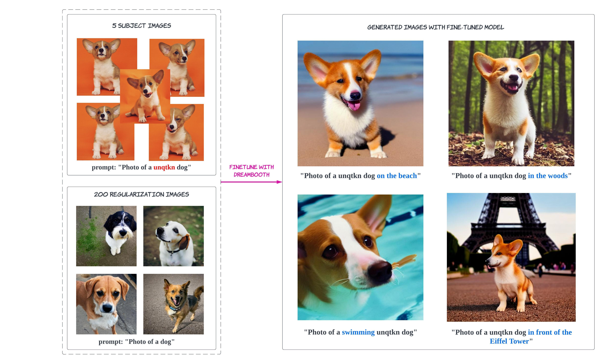

# Fine-tuning DreamBooth with Ray AIR

DreamBooth is a method for personalizing text-to-image models like Stable Diffusion with just a few (3-5) images of a subject. It allows the model to generate contextualized images of the subject in different scenes, poses, and views. This example demonstrates how to leverage Ray AIR to fine-tune a model with DreamBooth.

The demo tunes both the **Text Encoder** and **Unet** of Stable Diffusion, and utilizes the prior preserving loss function. To learn more about DreamBooth fine-tuning with prior-preserving loss, check out the [Diffusers documentation](https://huggingface.co/docs/diffusers/training/dreambooth#finetuning-with-priorpreserving-loss).

The example uses distributed data-parallelism to speed up training. Due to the large model sizes, each worker requires 2 A10G GPUs. By default, this demo is run with a `g5.12xlarge` instance that has 4 A10G GPUs (2 workers).



## How it works

The full code repository can be found [here](https://github.com/ray-project/ray/blob/master/python/ray/air/examples/dreambooth/). For an up-to-date description of how the code works, please refer to [the example in our documentation](https://docs.ray.io/en/master/ray-air/examples/dreambooth_finetuning.html). 


Given ~3-5 images of a subject, we fine-tune a text-to-image diffusion in the following steps:
- Fine-tuning the low-resolution text-to-image model with the input images paired with a text prompt containing a unique identifier ``unqtkn`` and the name of the class the subject belongs to (e.g., ``A photo of a unqtkn <class>``)
- At the same time, we apply a class-specific prior preservation loss, which leverages the semantic prior that the model has on the class and encourages it to generate diverse instances belong to the subject's class by injecting the class name in the text prompt (e.g., ``A photo of a <class>``). 

After fine-tuning we can run inference with this specific prompt. For instance: ``A photo of a unqtkn <class> in the beach`` will create an image of our subject. 

Reference: [DreamBooth: Fine Tuning Text-to-Image Diffusion Models for Subject-Driven Generation](https://dreambooth.github.io/)


## Fine-tuning with Dreambooth

```bash
# TLDR
bash finetune.sh
```

## Step 0: Preparation

Go to the example directory, and install dependencies.

```bash
cd dreambooth
pip install -Ur requirements.txt
```

Prepare some directories and environment variables.

```bash
export DATA_PREFIX="/mnt/local_storage/artifacts"
export ORIG_MODEL_NAME="CompVis/stable-diffusion-v1-4"
export ORIG_MODEL_HASH="249dd2d739844dea6a0bc7fc27b3c1d014720b28"
export ORIG_MODEL_DIR="$DATA_PREFIX/model-orig"
export ORIG_MODEL_PATH="$ORIG_MODEL_DIR/models--${ORIG_MODEL_NAME/\//--}/snapshots/$ORIG_MODEL_HASH"
export TUNED_MODEL_DIR="$DATA_PREFIX/model-tuned"
export IMAGES_REG_DIR="$DATA_PREFIX/images-reg"
export IMAGES_OWN_DIR="$DATA_PREFIX/images-own"
export IMAGES_NEW_DIR="$DATA_PREFIX/images-new"

export CLASS_NAME="car"

mkdir -p $ORIG_MODEL_DIR $TUNED_MODEL_DIR $IMAGES_REG_DIR $IMAGES_OWN_DIR $IMAGES_NEW_DIR
ln -s $DATA_PREFIX ./artifacts
```

Copy some images for fine-tuning into ``$IMAGES_OWN_DIR``.

```bash
cp -rf ./data/unqtkn/*.jpg "$IMAGES_OWN_DIR/"
```

## Step 1: Download the pre-trained model

Download and cache a pre-trained Stable-Diffusion model locally.
Default model and version are ``CompVis/stable-diffusion-v1-4``
at git hash ``3857c45b7d4e78b3ba0f39d4d7f50a2a05aa23d4``.

```bash
python src/cache_model.py --model_dir=$ORIG_MODEL_DIR --model_name=$ORIG_MODEL_NAME --revision=$ORIG_MODEL_HASH
```

## Step 2: Create the regularization images

Using the original stable-diffusion model to generate 200 regularization images for a class of subjects:

```bash
   python src/generate.py \
     --model_dir=$ORIG_MODEL_PATH \
     --output_dir=$IMAGES_REG_DIR \
     --prompts="photo of a $CLASS_NAME" \
     --num_samples_per_prompt=200
```

## Step 3: Fine-tune the model

Launch the training job with:

```bash
   python src/train.py \
     --model_dir=$ORIG_MODEL_PATH \
     --output_dir=$TUNED_MODEL_DIR \
     --instance_images_dir=$IMAGES_OWN_DIR \
     --instance_prompt="a photo of unqtkn $CLASS_NAME" \
     --class_images_dir=$IMAGES_REG_DIR \
     --class_prompt="a photo of a $CLASS_NAME"
```


# Image Generation with Tuned Model

```bash
# TLDR
bash inference.sh
```

Try your model with the same commandline as Step 2, but point
to your own model this time! 

```bash
   python run_model.py \
     --model_dir=$TUNED_MODEL_DIR \
     --output_dir=$IMAGES_NEW_DIR \
     --prompts="photo of a unqtkn $CLASS_NAME in the beach" \
     --num_samples_per_prompt=20
```

You can find the output images in `./artifacts/images-new`.